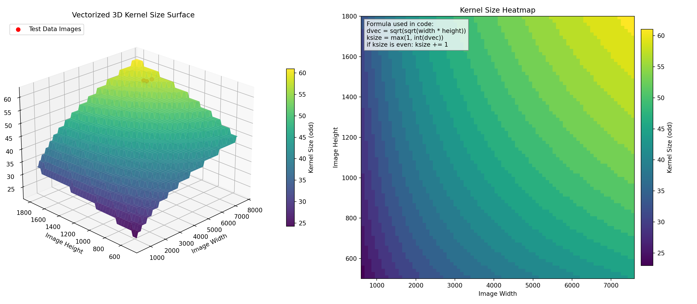
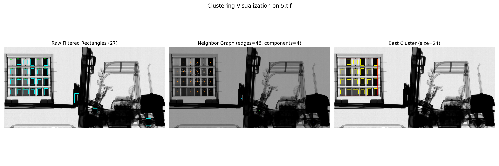
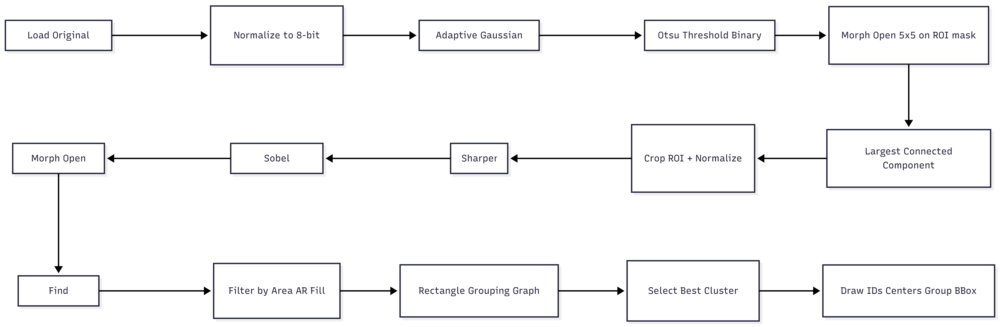
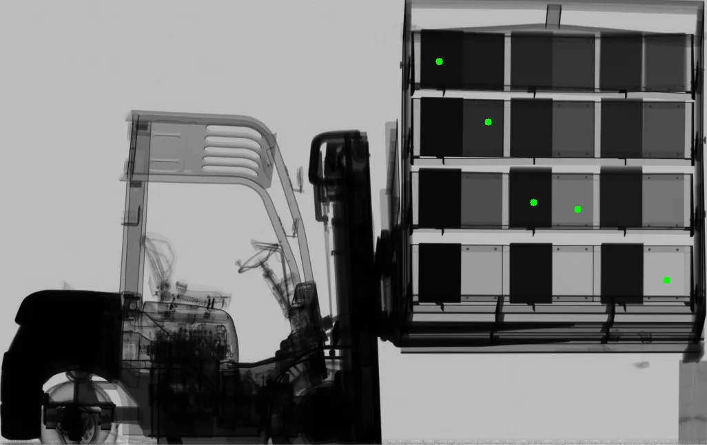
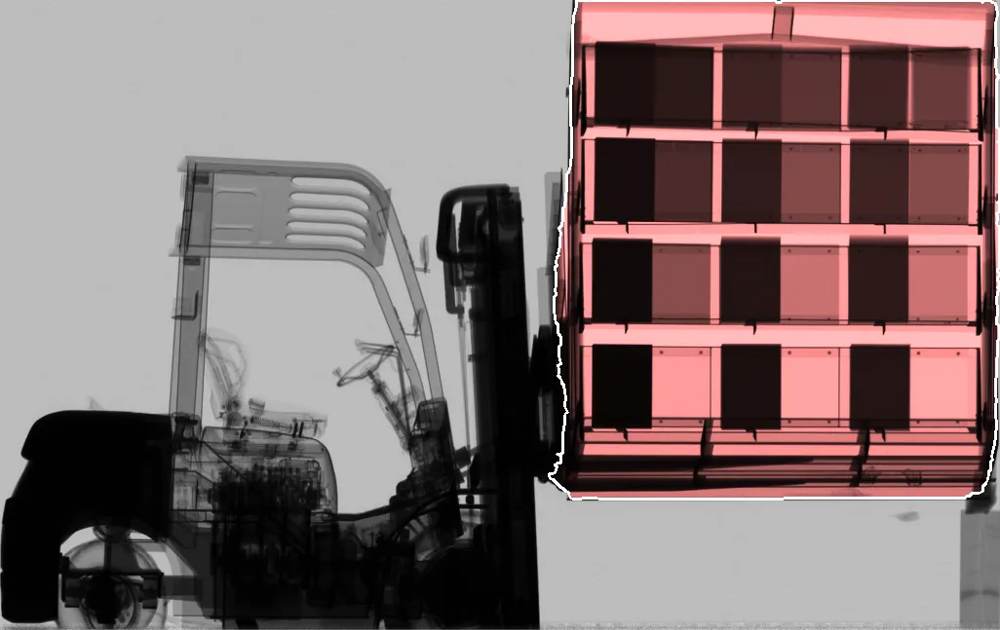
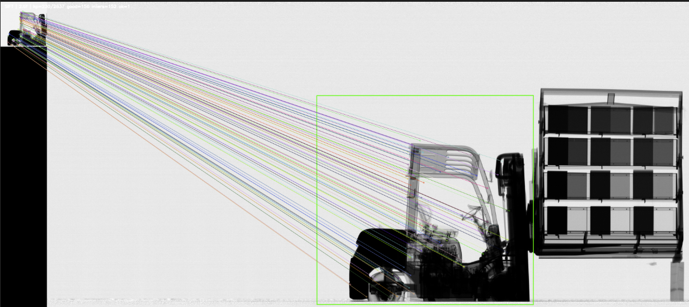
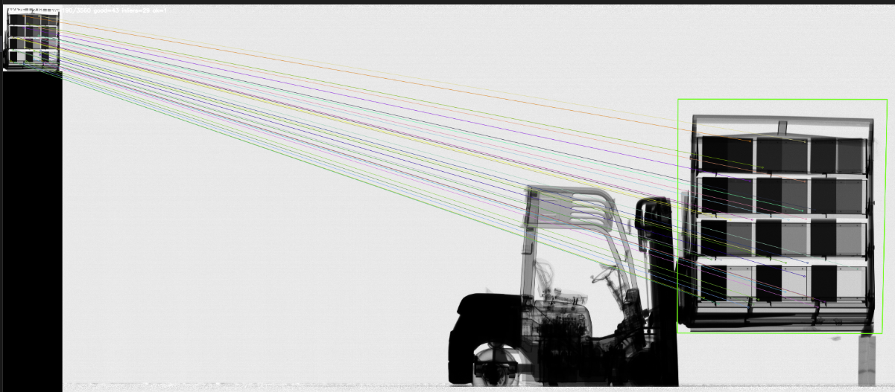

# MS Spectral Case Study

## Overview
This repository documents the core X-ray detection pipeline and its measurable behavior.
The implementation is based on these four scripts:
- `main.py`
- `common.py`
- `detect_roi.py`
- `detect_rectangles.py`

## Quick Start
### 1) Install dependencies
```bash
pip install -r requirements.txt
```

### 2) Run the main pipeline
```bash
python main.py --input "Test Data" --output "Results"
```

This command processes all `.tif/.tiff` images in `Test Data` and writes final visual outputs into `Results`.

## Script-by-Script Methodology
### `main.py`
### Purpose
End-to-end orchestration:
1. Parse CLI arguments (`--input`, `--output`).
2. Read images in grayscale (`cv.IMREAD_GRAYSCALE`).
3. Run ROI extraction (`detect_roi`).
4. Run rectangle detection and grouping (`detect_rectangles`).
5. Render final visualization (`visualize`) and save `*_bbox.png`.

### Key variables
- `args.input`, `args.output`
- `tiff_files`
- `gray_img`
- `roi_img`, `(rx, ry)`
- `rect_list`, `group_bbox`
- `raw_count`, `min_area`, `max_area`

---

### `common.py`
### Purpose
Shared constants and visualization utilities.

### Constants
- `MIN_AR = 0.4`
- `MAX_AR = 2.0`
- `MIN_FILL = 0.50`
- `MIN_AREA_RATIO = 0.00075`
- `MAX_AREA_RATIO = 0.01`

### Function: `calculate_kernel_size(img_shape)`
Uses image size to build adaptive odd kernel size.

Formulas:
- `height, width = img_shape[:2]`
- `dvec = sqrt(sqrt(width * height))`
- `ksize = max(1, int(dvec))`
- enforce odd:
  - if even: `ksize = ksize + 1`

Variables:
- `height`, `width`, `dvec`, `ksize`

#### Kernel Size Visualization (3D, Vectorized)
The following figure visualizes the vectorized mapping:
- Inputs: `width`, `height`
- Transformation: `dvec = sqrt(sqrt(width * height))`
- Output: odd `ksize`



### Function: `visualize(roi_img, rect_list, group_bbox=None)`
Draws:
- rectangle bounding boxes (`x, y, w, h`)
- rectangle center point:
  - `cx = x + (w // 2)`
  - `cy = y + (h // 2)`
- rectangle ID label: `id={idx}`
- optional grouped bounding box with padding `pad = 20`

Variables:
- `rect_list` item: `(x, y, w, h, _area, _ar, _fill)`
- `group_bbox`: `(gx, gy, gw, gh)`

---

### `detect_roi.py`
### Purpose
Extract the most relevant ROI from full image using Otsu + connected components.

### Function: `adaptive_gaussian(gray_img)`
1. `ksize = calculate_kernel_size(gray_img.shape)`
2. Sigma formula:
   - `sigma = 0.3 * (((ksize - 1) * 0.5) - 1) + 0.8`
3. Blur:
   - `GaussianBlur(gray_img, (ksize, ksize), sigma)`

Variables:
- `ksize`, `sigma`

### Function: `preprocess(gray_img)`
1. Normalize:
   - `normalized = cv.normalize(gray_img, None, 0, 255, cv.NORM_MINMAX, cv.CV_8U)`
2. Blur:
   - `gray_blurred = adaptive_gaussian(normalized)`
3. Otsu threshold:
   - `_otsu_val, binary_otsu = cv.threshold(gray_blurred, 0, 255, cv.THRESH_BINARY_INV | cv.THRESH_OTSU)`

Variables:
- `normalized`, `gray_blurred`, `_otsu_val`, `binary_otsu`

### Function: `refine_roi_mask(binary_mask)`
Morphological open for removing thin bridges:
- kernel: `MORPH_RECT(5, 5)`
- operation: `MORPH_OPEN`

Variables:
- `kernel`, `binary_mask`

### Function: `find_largest_component_bbox(binary_mask)`
Connected components:
- `n_labels, labels, stats, centroids = connectedComponentsWithStats(...)`
- scan labels `1..n_labels-1`
- choose component with max `stats[i, CC_STAT_AREA]`
- output bbox:
  - `x = CC_STAT_LEFT`
  - `y = CC_STAT_TOP`
  - `w = CC_STAT_WIDTH`
  - `h = CC_STAT_HEIGHT`

Variables:
- `n_labels`, `stats`, `best_label`, `best_area`, `x`, `y`, `w`, `h`

### Function: `detect_roi(img)`
Pipeline:
1. `binary_img = preprocess(img)`
2. `binary_img = refine_roi_mask(binary_img)`
3. `roi_data = find_largest_component_bbox(binary_img)`
4. Crop:
   - `out_roi = img[y:y+h, x:x+w]`
5. Normalize ROI to 8-bit.

Returned:
- `out_roi`
- top-left offset `(x, y)`

---

### `detect_rectangles.py`
### Purpose
Detect and group target rectangles inside ROI.

### Grouping constants
- `MIN_CLUSTER_SIZE = 6`
- `SIZE_SIMILARITY = 0.55`
- `MAX_DX_FACTOR = 2.8`
- `MAX_DY_FACTOR = 1.8`

### Function: `apply_sharpen(src)`
Kernel:
```text
[ 0 -1  0]
[-1  5 -1]
[ 0 -1  0]
```

Computation:
- `base = src.astype(float32)`
- `sharpened = filter2D(base, kernel)`
- blend:
  - `out = 0.5 * base + 0.5 * sharpened`
- clip to `[0, 255]`, cast `uint8`

Variables:
- `base`, `conv_kernel`, `sharpened`, `out`

### Function: `apply_sobel_mag(src)`
1. `ksize = min(31, calculate_kernel_size(src.shape))`
2. Scale input:
   - `src_f = src / 255.0`
3. Sobel gradients:
   - `rx = Sobel(src_f, dx=1, dy=0, ksize=ksize)`
   - `ry = Sobel(src_f, dx=0, dy=1, ksize=ksize)`
4. Magnitude:
   - `resp = magnitude(rx, ry) = sqrt(rx^2 + ry^2)`
5. Min-max normalization:
   - `disp = abs(resp)`
   - `out = (disp - dmin) / (dmax - dmin + 1e-6) * 255`

Variables:
- `ksize`, `src_f`, `rx`, `ry`, `resp`, `disp`, `dmin`, `dmax`

### Function: `apply_morphology(sobel_roi)`
- kernel: `MORPH_RECT(7, 7)`
- operation: `MORPH_OPEN`
- iteration: `1`

Variables:
- `morph_kernel`

### Function: `preprocess(roi)`
Sequential preprocessing:
1. `sharpen_roi = apply_sharpen(roi)`
2. `sobel_roi = apply_sobel_mag(sharpen_roi)`
3. `morph_roi = apply_morphology(sobel_roi)`

Returned:
- `morph_roi`

### Function: `extract_contours(...)`
From `thresholded` mask:
1. `contours = findContours(...)`
2. For each contour:
   - `area = contourArea(cnt)`
   - bbox: `(x, y, w, h) = boundingRect(cnt)`
   - aspect ratio:
     - `ar = w / h`
   - fill ratio:
     - `fill = area / (w * h)`
3. Filters:
   - `min_area <= area <= max_area`
   - `min_ar <= ar <= max_ar`
   - `fill >= min_fill`

Output item format:
- `(x, y, w, h, area, ar, fill)`

### Function: `_cluster_score(component, rects)`
For a connected rectangle cluster:
1. cluster bbox:
   - `bw = max(x2) - min(x)`
   - `bh = max(y2) - min(y)`
2. area:
   - `bbox_area = max(1, bw * bh)`
3. density:
   - `density = len(component) / bbox_area`

Score tuple:
- `(len(component), density)` (lexicographic max)

### Function: `group_rectangles(rects)`
Graph-based grouping:
1. Node = rectangle.
2. Connect two nodes if both hold:
   - size similarity:
     - `w_sim = min(wi, wj) / max(wi, wj)`
     - `h_sim = min(hi, hj) / max(hi, hj)`
     - `w_sim >= SIZE_SIMILARITY and h_sim >= SIZE_SIMILARITY`
   - center distance constraint:
     - `dx = |cxi - cxj| <= MAX_DX_FACTOR * w_ref`
     - `dy = |cyi - cyj| <= MAX_DY_FACTOR * h_ref`
3. Extract connected components.
4. Keep valid clusters:
   - `len(component) >= MIN_CLUSTER_SIZE`
5. Select best cluster by `_cluster_score`.

Returns:
- `grouped` rectangles
- `group_bbox = (min_x, min_y, width, height)`

#### Clustering Visualization
The following figure shows:
1. Raw filtered rectangles,
2. Neighbor graph built by `SIZE_SIMILARITY`, `MAX_DX_FACTOR`, `MAX_DY_FACTOR`,
3. Best connected cluster selected by `_cluster_score`.



### Function: `detect_rectangles(roi)`
Dynamic area bounds from ROI:
- `roi_area = roi_h * roi_w`
- `min_area = roi_area * MIN_AREA_RATIO`
- `max_area = roi_area * MAX_AREA_RATIO`

Pipeline:
1. `morph_roi = preprocess(roi)`
2. `raw_boxes = extract_contours(morph_roi, min_area=min_area, max_area=max_area)`
3. `grouped_boxes, group_bbox = group_rectangles(raw_boxes)`

Returns:
- `grouped_boxes`
- `morph_roi`
- `min_area`, `max_area`
- `group_bbox`
- `len(raw_boxes)` as `raw_count`

## Core Parameters (Table 1)
| Variable | Value | Script | Purpose |
|---|---:|---|---|
| `MIN_AR` | `0.4` | `common.py` | Minimum accepted aspect ratio |
| `MAX_AR` | `2.0` | `common.py` | Maximum accepted aspect ratio |
| `MIN_FILL` | `0.50` | `common.py` | Minimum contour fill ratio (`area / (w*h)`) |
| `MIN_AREA_RATIO` | `0.00075` | `common.py` | Minimum contour area ratio w.r.t ROI area |
| `MAX_AREA_RATIO` | `0.01` | `common.py` | Maximum contour area ratio w.r.t ROI area |
| `MIN_CLUSTER_SIZE` | `6` | `detect_rectangles.py` | Minimum rectangles needed for a valid cluster |
| `SIZE_SIMILARITY` | `0.55` | `detect_rectangles.py` | Width/height similarity threshold |
| `MAX_DX_FACTOR` | `2.8` | `detect_rectangles.py` | Max x-distance between neighbor centers |
| `MAX_DY_FACTOR` | `1.8` | `detect_rectangles.py` | Max y-distance between neighbor centers |

## 11-Image Metrics (Table 2)
Otsu values below are computed from the **original full-resolution images**.

| Image | Otsu (Original) | Raw Rect | Grouped Rect | AR Min | AR Mean | AR Max | Fill Min | Fill Mean | Fill Max |
|---|---:|---:|---:|---:|---:|---:|---:|---:|---:|
| 0.tif | 142.0 | 26 | 24 | 0.672 | 0.876 | 0.978 | 0.850 | 0.923 | 0.960 |
| 1.tif | 145.0 | 26 | 24 | 0.664 | 0.876 | 0.978 | 0.847 | 0.924 | 0.964 |
| 2.tif | 141.0 | 27 | 24 | 0.644 | 0.845 | 0.978 | 0.815 | 0.905 | 0.950 |
| 3.tif | 142.0 | 26 | 24 | 0.664 | 0.879 | 0.978 | 0.853 | 0.929 | 0.968 |
| 4.tif | 140.0 | 25 | 24 | 0.523 | 0.781 | 1.233 | 0.721 | 0.868 | 0.935 |
| 5.tif | 139.0 | 27 | 24 | 0.515 | 0.759 | 1.182 | 0.729 | 0.828 | 0.928 |
| 6.tif | 140.0 | 25 | 24 | 0.515 | 0.783 | 1.233 | 0.716 | 0.869 | 0.927 |
| 7.tif | 140.0 | 25 | 24 | 0.523 | 0.789 | 1.205 | 0.753 | 0.873 | 0.936 |
| 8.tif | 145.0 | 25 | 24 | 0.515 | 0.803 | 1.244 | 0.713 | 0.878 | 0.933 |
| 9.tif | 145.0 | 25 | 24 | 0.538 | 0.803 | 1.217 | 0.730 | 0.884 | 0.931 |
| 10.tif | 145.0 | 25 | 24 | 0.523 | 0.802 | 1.244 | 0.764 | 0.885 | 0.944 |

Interpretation:
- Otsu values are stable (`~139-145`) over the dataset.
- Final grouped rectangle count is stable (`24`) across all 11 images.

## Visual Outputs
### Pipeline flowchart


### Step-by-step pipeline animation


### Final outputs across all 11 images


## Further Works (Visual Evidence Only)
### Lightweight SAM - Forklift result


### Lightweight SAM - Pallet result


### Forklift feature matching result


### Pallet feature matching result

